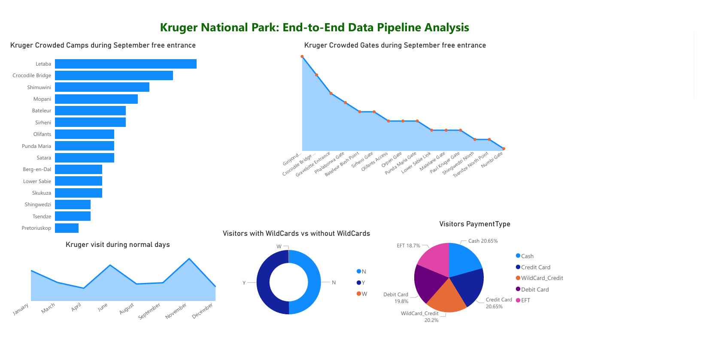
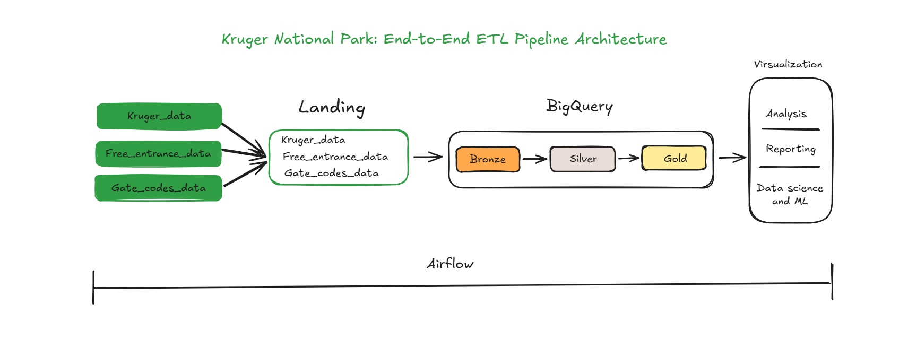
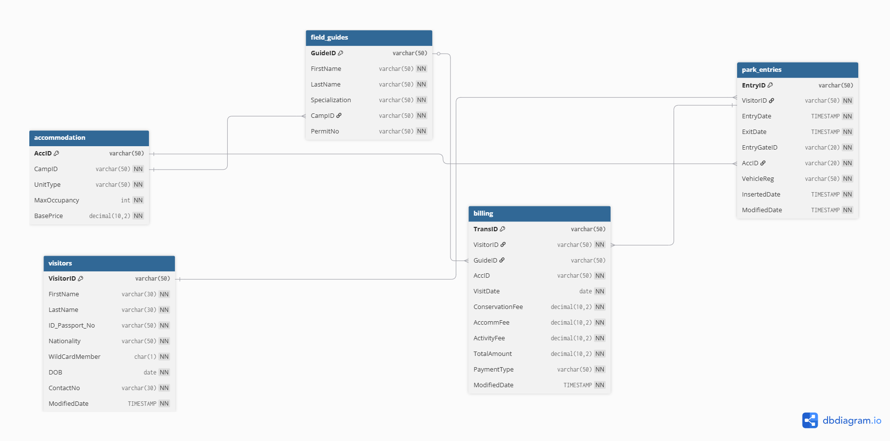

# 🐘 Kruger National Park: End-to-End ETL Pipeline on GCP

<code>I dedicate this project to my role model <i>JOHN DEVAR</i> who is a surgeon, who inspired me to work hard since i was in my final year.</code>

`Outside my professional work i love camping in the Kruger National Park`

## 📌 What is this project?

This project helps **Kruger National Park** manage large crowds during free entrance and busy days in different camp sites. I built a system on **Google Cloud (GCP)** that looks at how many people enter the park with **wild-cards** or without wild-cards. This helps Kruger-National-Park managers know when to hire more staff and where to send more security guards.

---

## ⚠️ The Problem

Sometimes the park gets too full, especially during **"Free Week" in September**.

- **Too many people:** Camps get crowded and it is hard for staff to help everyone.
- **Safety:** When there are too many visitors, it is harder for security to keep everyone safe.
- **No Plan:** Before this, managers didn't have a clear way to count who was coming (like local people vs. tourists) to plan for help.

---

## 💡 The Solution

I built a "Data Pipeline" that collects information from the park gates, reception and organizes it, for reporting.

Using the dashboard below, managers can now understand which Kruger Camps, Gates gets crowded and maximize security guards and staff to ensure safety of animals.

### PowerBI Dashboard analysis

1. **Bar graph** - This graph shows which campsite gets more crowded during september free entrance
2. **Pie Chart graph** - This graph shows visitors and their payment type
3. **Ring graph** - This graph shows visitors who access the park using wild card and visitors who access the park without wild cards
4. **Area graph** - This graph shows which month do visitors love visiting kruger national park

### GCP services i used:

- **Google Cloud Storage:** For storing raw and processed datafiles.
- **BigQuery:** For storing and querying structured data.
- **Cloud SQL:** Database to store data before centralizing it to Landing
- **Dataproc:** For processing large-scale data with Apache Spark
- **Cloud Build:** For CI/CD with the help of Github
- **Cloud Composer:** For automating ETL pipelines and workflow orchestration
- **IAM:** Enables other service to communicate with the other services, like Cloud Composer trying to access resources on BigQuery

---

### Diagram architecture

- Data(Kruger_data, Free_entrance, Gate_codes_data) comes from different sources in a form of csv. I then ingest them to Cloud Storage in Landing folder to centralize them. From landing i ingest them to bronze for raw data, then i move them silver for cleaning and using SCD type 2 to keep the history record for incremental tables, then i move them to Gold layer where i aggregate them for business use case. All these steps done using airflow.

---

### ER Diagram for Kruger tables

## 

## 🚀 What this project shows

- **Handling Crowds:** It shows exactly how much busier the park gets during the "Free September" days.
- **Better Service:** It helps the park put more workers at the busiest gates so visitors don't have to wait in long lines.
- **Smart Security:** It tells management when to send extra security to the crowded areas to keep people and animals safe.

---

## 📈 Results

- **More Staff:** Using this data, the park can prove they need more seasonal workers in September.
- **Happy Visitors:** People get faster service because the park is ready for them.
- **Better Planning:** Managers can now stop guessing and start using real numbers to run the park.

---

Built and designed by Hulisani Ratshiedana
**Contact:** rachyhuly17@gmail.com
