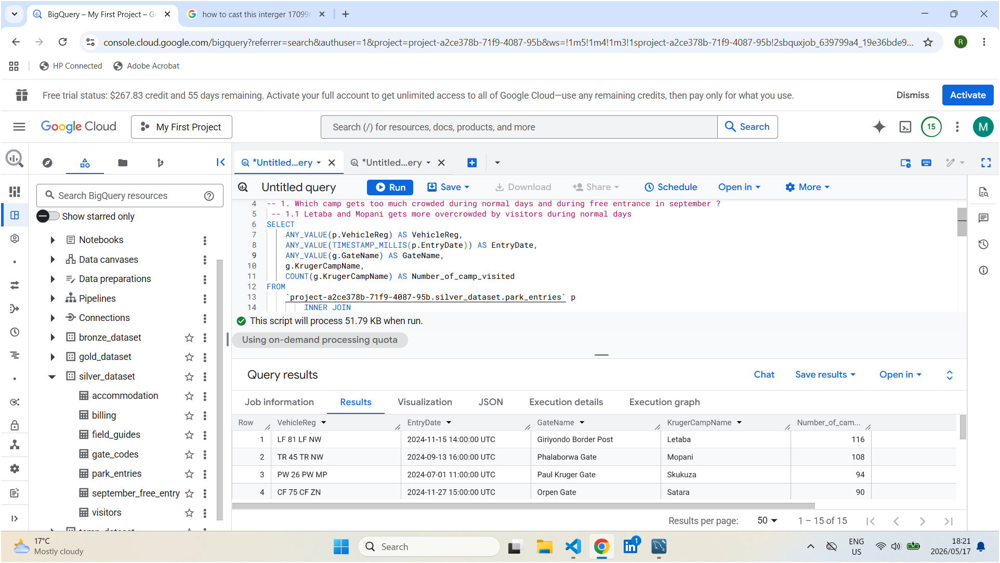
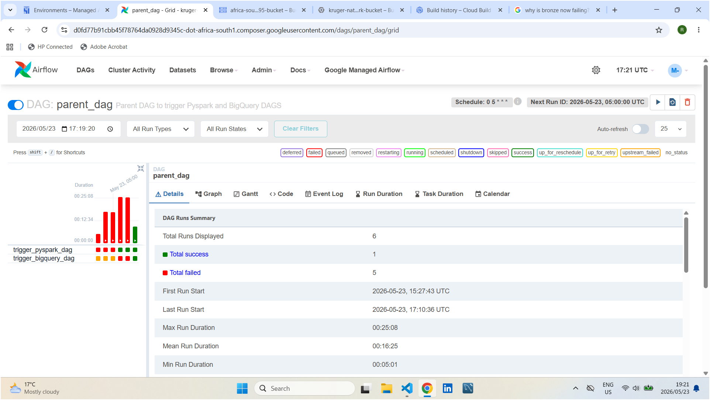
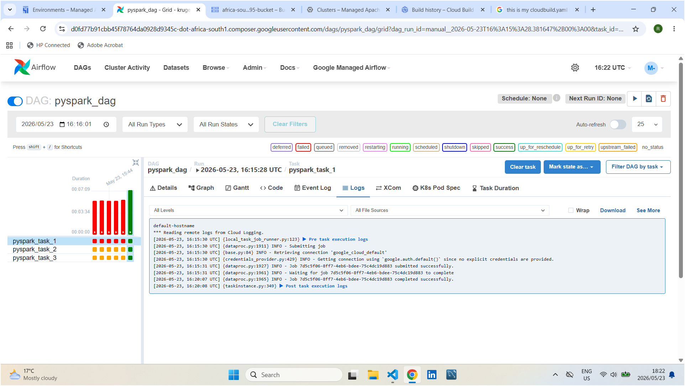

## 🚀 Setup steps

Follow these steps to run my entire Kruger-National-Park :End-to-End Pipeline on GCP project after cloning the repository.

### 📋 Prerequisites Before You Begin

1. A **GCP Account** with an active billing account or Free-trial **GCP Account**

---

### Step 1: Initialize Cloud SQL

1. Go to **Cloud SQL** and create MySQL instance named `kruger-mysql-db`.
2. Create a database named `kruger-db`.
3. Connect to the database and create 5 tables for kruger_national_park

### Step 2: Create Cloud Storage Data Lake

1. Create cloud storage and data folder, landing folder, config folder, temp folder
2. Upload config csv file to config folder, 5 csv files to data folder, free entrance and gate codes to landing

### Step 3: Create Cluster

1. Go to cloud terminal and create cluster
2. Initialize JupyterLab and extract 5 tables from data folder and ingest to landing folder
3. Extract free entrance and gate codes files and ingest to Bronze layer in BigQuery

### Step 4: Open BigQuery

1. Create Bronze, Silver, Gold, Temp datasets on bigquery
2. Ingest 5kruger tables using External tables to bronze layer
3. Ingest all datasets to Silver layer using SCD type 2
4. Aggregate tables for business usecase and store to gold layer

   ### Screen short how Gold layer looks

   ## 

### Step 5: Connect CI/CD Pipeline

1. Create Cloud Build for to trigger CI/CD
1. Deploy project to GitHub
1. Create connection between GitHub and Cloud build

### Step 6: Airflow

1. Create Cloud Composer
2. Upload DAGS to cloud storage
3. Trigger DAGS manually

### Screen short how Parent DAG and Pyspark DAG ran successfully

## 

## 
